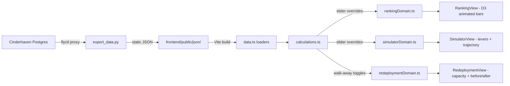

# feat: Interactive retailer cost-to-serve model and renegotiation simulator

## Summary

A React 19 + Vite + TypeScript + D3 static SPA deployed on Cloudflare Pages. The cost-to-serve calculation engine lives in TypeScript for zero-latency slider interactivity, with a parallel Python implementation as the canonical Q1-importable component. Data flows from the Cinderhaven platform through Python export scripts to pre-computed JSON consumed at build time. The project follows the `frontend/` convention established in retailer-deduction-recovery.

---

## Problem Frame

Specialty food founders rank retailers by gross revenue because true cost-to-serve is never attributed to a specific account. The result: anchor retailers subsidized by profitable ones, with losses compounding over time. (See origin: `docs/brainstorms/2026-06-03-retailer-renegotiation-simulator-requirements.md`)

---

## Requirements

- R1. Bold headline + one sentence framing, then fork to narrative or simulator path
- R2. Both paths converge at the same simulator
- R3. Narrative path: editorial prose per cost layer explaining attribution and importance
- R4. Each cost layer section includes an interactive visual example
- R5. Animated D3 ranking of 7+ retailers: gross revenue → true contribution, inversion visible
- R6. Distributor costs (UNFI, KeHE) folded into the retailer they serve
- R7. Interactive levers per cost component with negotiability tags
- R8. Live ranking reshuffle + 24-month trajectory projection inside the simulator
- R9. Levers show the flip point or exact terms change needed
- R10. Walk-away toggle per retailer with initial impact summary
- R11. Dedicated redeployment view: freed working capital, capacity, trade spend, net effect
- R12. Capacity constraint sliders per remaining retailer in redeployment view
- R13. Before/after portfolio comparison in redeployment view
- R14. Python cost-allocation engine as standalone Q1-importable component
- R15. Engine accepts per-retailer inputs + overrides, returns contributions and rankings
- R16. Synthetic data from Cinderhaven, realistic enough for a skeptical CFO
- R17. At least one major retailer runs net-negative honestly from the data
- R18. `returns_rate` field added to Cinderhaven platform schema
- R19. Lailara Design System v2 throughout (Canvas, Playfair Display, Source Sans 3, HK teal, click-to-pin, 200ms transitions)
- R20. Desktop-first; must not break on mobile
- R21. Fully self-explanatory without narration

**Origin actors:** A1 (cold portfolio visitor), A2 (guided visitor in a meeting)
**Origin flows:** F1 (self-guided exploration), F2 (guided walkthrough)
**Origin acceptance examples:** AE1 (covers R5, R6, R17), AE2 (covers R7, R8), AE3 (covers R10, R11, R12, R13), AE4 (covers R2, R3, R4), AE5 (covers R6)

---

## Scope Boundaries

- CTA, lead capture, or sales conversion flow (handled by lailarallc.com)
- Predicting buyer behavior or negotiation tactics
- Cross-industry generalization beyond specialty food retail
- Client data cleanup automation
- Rebuilding Where the Money Comes From
- Full mobile-optimized experience
- DTC-only or enterprise SaaS scenarios
- Real-time database connections
- FastAPI backend (replaced by client-side calculations)

### Deferred to Follow-Up Work

- Observable Plot migration for simpler chart components: future evaluation after D3 patterns are established
- Print/PDF export: can be added post-launch following contract-to-cash print styles pattern

---

## Context & Research

### Relevant Code and Patterns

- `retailer-deduction-recovery/frontend/src/App.tsx` — state management pattern: useState + useMemo, no Redux. Selection via discriminated union type
- `retailer-deduction-recovery/frontend/src/sankey/SankeyView.tsx` — React-renders-SVG D3 integration (D3 computes layout, React renders JSX)
- `retailer-deduction-recovery/frontend/src/simulation/RecoverySimulationView.tsx` — toggle-based simulation: typed toggles → pure `simulate()` function → memoized baseline/projection → delta display. Closest precedent for renegotiation levers
- `retailer-deduction-recovery/frontend/src/data.ts` — async JSON loaders with shape validation before casting
- `retailer-deduction-recovery/frontend/src/types.ts` — comprehensive TypeScript domain model (206 lines)
- `contract-to-cash/frontend/src/styles.css` — self-hosted woff2 fonts in `public/fonts/` with `@font-face` + `font-display: swap`
- `contract-to-cash/frontend/src/chartConstants.ts` — teal palette array, `formatDollars()`, `formatCompact()`
- `channel-profitability-analysis/scripts/generate_json.py` — Python data export from Postgres to static JSON

### Institutional Learnings

- **Calculation correctness** (critical): 17 bugs documented in retail-velocity-decision-tool. Key rules: round only at presentation layer, NaN-first branching in classification functions, threshold registry in constants, algebraic reduction check on every formula, input perturbation test for every derived metric (see origin: `retail-velocity-decision-tool/docs/solutions/logic-errors/velocity-tool-calculation-correctness-fixes-2026-05-22.md`)
- **Circular formula detection** (critical): Formula `a / (a / b)` reduces to constant `b` regardless of input. Every metric must be verified to actually depend on its inputs via perturbation testing (see origin: `trade-spend-data-diagnostic/docs/solutions/logic-errors/circular-hardcoded-metric-calculation.md`)
- **CSS design token drift**: Every hex value must appear exactly once in `:root`. Grep for `#[0-9a-fA-F]{3,8}` outside `:root` before every milestone. Token names must match Lailara Design System spec (see origin: `sku-rationalization-framework/docs/solutions/conventions/css-design-token-drift-2026-05-28.md`)
- **CPG units trap**: `units_ordered` is in cases, not individual units. Multiply by `case_pack_qty` (see origin: `where-the-money-comes-from/docs/solutions/`)
- **Data pipeline key rename danger**: Renaming keys in extraction scripts breaks TypeScript components. Update both in the same commit

### External References

- Lailara Design System v2 specification: `~/projects/published/lailara-design-system/LAILARA_DESIGN_SYSTEM.md`
- Cinderhaven data platform schema: `archived/cinderhaven-data/README.md` (30 tables, 11 retailers)

---

## Key Technical Decisions

- **Static SPA with client-side calculations (not FastAPI):** Every Lailara portfolio piece is a static SPA. Client-side TypeScript calculations give zero-latency slider response. The Python engine exists separately for Q1 import. The brief's FastAPI assumption is replaced by the established pattern. (Confirmed in synthesis)
- **Cloudflare Pages deployment (not Fly.io):** Follows from the static SPA architecture. Fly.io is reserved for full-stack apps (Competitive Shelf Intelligence). Cloudflare Pages via Wrangler is the standard deployment target
- **React-renders-SVG for D3 integration:** D3 handles layout computation (scales, transitions, data joins); React renders SVG elements via JSX. Avoids D3/React DOM ownership conflicts. Matches retailer-deduction-recovery Sankey pattern
- **Dual calculation implementation:** Cost model formulas exist in Python (canonical for Q1, data generation) and TypeScript (frontend interactivity). Validated against each other via shared test fixtures. Maintenance cost accepted for zero-latency interaction
- **D3 over Observable Plot:** Observable Plot is the team default for analytical charts, but the simulator's slider-driven real-time recalculation needs D3's imperative update model and precise transition control
- **useState + useMemo for state management:** No Redux or context providers. Matches retailer-deduction-recovery's approach. Selection state as discriminated union type. Computed state via useMemo
- **Calculation integrity rules from day one:** Rounding only at presentation layer. NaN-first branching. Threshold constants registry. Algebraic reduction checks. Input perturbation tests for every derived metric

---

## Open Questions

### Resolved During Planning

- **Frontend framework:** React 19 + Vite + TypeScript + D3 — matches retailer-deduction-recovery, the most complex interactive piece in the portfolio
- **Client-side vs server-side calculations:** Client-side TypeScript — zero-latency slider response, matches every other portfolio piece
- **D3 integration approach:** React-renders-SVG — from retailer-deduction-recovery Sankey pattern

### Deferred to Implementation

- **Exact Q1 interface contract:** The Python engine's function signature will be finalized when the Question Engine's consumer requirements are clearer. Design for `calculate_contributions(retailers, overrides) -> contributions` shape
- **Specific retailer list and financial profiles:** Determined during U1 data audit against Cinderhaven schema. Need 7+ retailers with at least one net-negative anchor
- **Full Cinderhaven schema gaps beyond returns_rate:** Audit in U1 will surface all missing fields
- **D3 transition performance with 7+ animated bars:** May need to profile and optimize during U4. Fallback: staggered transitions rather than simultaneous

---

## Output Structure

```
retailer-scorecard-renegotiation-simulator/
  frontend/
    package.json
    vite.config.ts
    tsconfig.json
    public/
      fonts/                          # Self-hosted Playfair Display + Source Sans 3 woff2
      json/                           # Pre-computed data from Python pipeline
    src/
      App.tsx                         # Root: state management, view composition
      App.css                         # Lailara Design System CSS custom properties
      main.tsx                        # Entry point
      types.ts                        # Domain type definitions
      data.ts                         # JSON data loading
      calculations.ts                 # Cost-to-serve engine (TypeScript)
      constants.ts                    # Thresholds, palette, negotiability tags
      entry/
        EntryView.tsx                 # Headline + path fork
      ranking/
        RankingView.tsx               # Animated ranking flip
        rankingDomain.ts              # D3 layout + transition computation
      simulator/
        SimulatorView.tsx             # Levers + trajectory panel
        simulatorDomain.ts            # Lever interaction + recalculation
      redeployment/
        RedeploymentView.tsx          # Walk-away + capacity sliders + before/after
        redeploymentDomain.ts         # Redeployment math
      methodology/
        MethodologyView.tsx           # Narrative path: editorial + interactive examples
  scripts/
    export_data.py                    # Cinderhaven → static JSON pipeline
    validate_calculations.py          # Cross-validate Python vs TypeScript outputs
  engine/
    __init__.py
    cost_model.py                     # Core cost-allocation engine (Q1 reusable)
    types.py                          # Python data types
  tests/
    test_cost_model.py                # Python engine tests
    fixtures/                         # Shared test fixtures (Python + TypeScript)
```

---

## High-Level Technical Design

> *This illustrates the intended approach and is directional guidance for review, not implementation specification. The implementing agent should treat it as context, not code to reproduce.*

### Data Flow



### Cost-Allocation Model (Six Layers)

```
True Contribution = Gross Revenue
  - Deductions (OTIF, shortages, pricing chargebacks)
  - Trade Spend (slotting, promo, MCBs)
  - Working-Capital Drag (payment_terms_days × daily_revenue × cost_of_capital)
  - Labor Overhead (portal hours × hourly_rate, dispute hours × hourly_rate)
  - Swell & Returns (returns_rate × gross_revenue)
  - Logistics Variance (freight_differential + MOQ_penalties + pallet_surcharges)
```

Each layer maps to a renegotiation lever with a negotiability tag:
- Deductions → "Partly" (compliance is on you)
- Trade Spend → "Often" (most negotiable)
- Working Capital → "Sometimes" (terms move with scale)
- Labor → "Internal" (fixed by automation, not the buyer)
- Swell & Returns → "Rarely" (contractual thresholds are sticky)
- Logistics → "Sometimes" (bracket pricing, MOQ negotiable)

### Slider Interaction Model

```
User drags lever → new value stored in React state →
  useMemo recalculates all retailer contributions →
    ranking order recomputed → D3 transition animates reorder →
      trajectory projection updated with new 24-month curve
```

All calculations run synchronously in the browser. No API calls. No debouncing needed.

---

## Implementation Units

### U1. Cinderhaven schema audit + data enrichment

**Goal:** Audit the Cinderhaven platform for all fields needed by the six cost layers. Add missing fields (confirmed: `returns_rate`). Engineer synthetic retailer profiles for 7+ retailers where at least one anchor runs net-negative from honest cost attribution.

**Requirements:** R6, R16, R17, R18

**Dependencies:** None

**Files:**
- Modify: Cinderhaven platform schema (separate repo)
- Create: `scripts/export_data.py`
- Create: `frontend/public/json/retailers.json`
- Create: `tests/fixtures/retailer_profiles.json`

**Approach:**
- Query existing Cinderhaven tables for retailer-level data availability across all six cost layers
- Identify gaps: `returns_rate` confirmed missing; audit for `labor_hours_by_retailer`, `freight_differential`, `pallet_surcharges`
- Enrich the platform with missing fields using realistic synthetic values
- Design retailer profiles: Walmart (high revenue, high costs → net-negative anchor), Costco (moderate revenue, efficient → positive), Whole Foods via UNFI (distributor costs folded in), 4+ regionals/specialty with varying profiles
- Export to JSON via Python script using the established `flyctl proxy` → Python → JSON pipeline
- Include distributor cost attribution: UNFI/KeHE margins, terms, compliance costs assigned to the retailers they serve

**Patterns to follow:**
- `channel-profitability-analysis/scripts/generate_json.py` — Python export from Postgres
- `retailer-deduction-recovery/data/schema.md` — schema documentation format

**Test scenarios:**
- Happy path: Export produces valid JSON with 7+ retailers, each having all six cost layers populated
- Happy path: At least one retailer has negative true contribution despite top-3 gross revenue
- Edge case: Retailer served through distributor (e.g., Whole Foods via UNFI) includes distributor margin in its cost stack
- Edge case: DTC channel has no distributor costs, no OTIF penalties, minimal logistics variance
- Integration: Exported JSON matches the TypeScript `Retailer` interface shape exactly (validated by import)

**Verification:**
- JSON file loads in a TypeScript test and passes type validation
- Manual spot-check: one retailer's true contribution can be hand-verified against the six cost layers
- The anchor retailer's inversion is mathematically honest — driven by the data, not hardcoded ranking

---

### U2. Python cost-allocation engine

**Goal:** Build the standalone Python cost-allocation library that computes true contribution per retailer. Clean interface for Question Engine Q1 import. Tested independently of the frontend.

**Requirements:** R14, R15

**Dependencies:** U1

**Files:**
- Create: `engine/__init__.py`
- Create: `engine/cost_model.py`
- Create: `engine/types.py`
- Create: `tests/test_cost_model.py`
- Create: `tests/fixtures/expected_outputs.json`

**Approach:**
- Define `RetailerInput` and `RetailerContribution` data classes
- Implement `calculate_contributions(retailers, overrides)` as a pure function: takes a list of retailer inputs and optional lever overrides, returns ranked contributions
- Each cost layer is a separate, testable calculation function
- Lever interactions: price change auto-scales percentage-based trade spend; terms change flows to carrying cost
- Overrides map to the six renegotiation levers
- Generate shared test fixtures (JSON) for cross-validation with the TypeScript implementation

**Execution note:** Test-first. Write tests for each cost layer calculation before implementing.

**Patterns to follow:**
- `retailer-deduction-recovery/frontend/src/simulation/` — pure `simulate()` function pattern adapted to Python

**Test scenarios:**
- Happy path: Given 7 retailers with known inputs, returns correct true contribution for each, correctly ranked
- Happy path: Given overrides (trade spend -2%, terms 60→45), contribution recalculates and ranking reshuffles
- Edge case: All retailers profitable — no inversion occurs, ranking stays the same
- Edge case: Override makes a negative retailer positive — ranking changes appropriately
- Edge case: Zero gross revenue retailer — no division by zero, returns zero contribution
- Error path: NaN input for a cost layer — handled gracefully (NaN-first branching per learnings)
- Integration: Perturbation test — changing one input changes output proportionally (circular formula guard per learnings)

**Verification:**
- All tests pass
- Engine importable as `from engine.cost_model import calculate_contributions`
- Shared fixture outputs match hand-calculated expected values

---

### U3. Frontend scaffolding + TypeScript calculation engine

**Goal:** Set up the React 19 + Vite + TypeScript + D3 project with Lailara Design System integration. Implement the TypeScript cost-to-serve calculation engine. Validate against the Python engine via shared fixtures.

**Requirements:** R19, R20, R21

**Dependencies:** U1, U2

**Files:**
- Create: `frontend/package.json`
- Create: `frontend/vite.config.ts`
- Create: `frontend/tsconfig.json`
- Create: `frontend/src/main.tsx`
- Create: `frontend/src/App.tsx`
- Create: `frontend/src/App.css`
- Create: `frontend/src/types.ts`
- Create: `frontend/src/data.ts`
- Create: `frontend/src/calculations.ts`
- Create: `frontend/src/constants.ts`
- Create: `frontend/public/fonts/` (woff2 files)
- Create: `scripts/validate_calculations.py`
- Test: `frontend/src/calculations.test.ts`

**Approach:**
- Scaffold React 19 + Vite + TypeScript following `frontend/` convention
- CSS custom properties in `:root` mapping to Lailara Design System tokens (Canvas, London greyscale, Chicago navy, HK teal palette, Tokyo/Singapore/NY, semantic status colors)
- Self-hosted Playfair Display + Source Sans 3 woff2 in `public/fonts/` with `@font-face` declarations
- `types.ts`: `Retailer`, `CostLayer`, `ContributionResult`, `LeverOverrides`, `NegotiabilityTag` types
- `calculations.ts`: Pure functions mirroring the Python engine — `calculateContributions()`, per-layer calculation functions, ranking sort
- `constants.ts`: Teal palette array, negotiability tags per layer, threshold constants, `formatDollars()`, `formatCompact()`
- `data.ts`: Async JSON loader following retailer-deduction-recovery pattern
- Cross-validation script: loads shared fixtures, runs both Python and TypeScript calculations, asserts outputs match within floating-point tolerance

**Patterns to follow:**
- `retailer-deduction-recovery/frontend/` — project structure, package.json, vite.config
- `contract-to-cash/frontend/src/styles.css` — self-hosted font `@font-face` declarations
- `contract-to-cash/frontend/src/chartConstants.ts` — palette + formatting utilities
- `retailer-deduction-recovery/frontend/src/data.ts` — async JSON loaders

**Test scenarios:**
- Happy path: TypeScript `calculateContributions()` output matches Python engine output for all shared fixtures within floating-point tolerance
- Happy path: Rounding occurs only at presentation layer — intermediate values preserve full precision
- Edge case: Lever override of 0% trade spend produces valid (not NaN) contribution
- Edge case: All six cost layers at maximum — retailer contribution goes deeply negative without errors
- Integration: `data.ts` loads exported JSON and type-checks against `types.ts` interfaces

**Verification:**
- `npm run dev` serves the app with Canvas background, correct fonts, correct colors
- Cross-validation script passes: all shared fixtures produce matching outputs
- CSS audit: no hex values outside `:root` block

---

### U4. Ranking visualization with animated flip

**Goal:** Build the D3 animated ranking chart showing gross revenue vs. true contribution, with the inversion animated. This is the hook — the most complex D3 work and the highest-risk frontend task. De-risk early.

**Requirements:** R5, R6, R17, R21. Covers AE1, AE5.

**Dependencies:** U3

**Files:**
- Create: `frontend/src/ranking/RankingView.tsx`
- Create: `frontend/src/ranking/rankingDomain.ts`
- Create: `frontend/src/ranking/RankingView.css`
- Test: `frontend/src/ranking/rankingDomain.test.ts`

**Approach:**
- React-renders-SVG pattern: D3 computes scales, positions, and transition interpolations; React renders `<rect>`, `<text>`, `<line>` via JSX
- Two views of the same data: gross revenue bars (initial state) and true contribution bars (final state)
- Animation: bars re-sort from gross ranking to contribution ranking with smooth D3 transitions (200ms ease-out per design system). Use `d3-transition` for position interpolation
- HK teal sequential palette: darkest for largest contribution, lightest for smallest. Bars that flip from positive to negative transition to Tokyo palette
- Every bar has a text label (retailer name + formatted value) as secondary identification channel
- Horizontal gridlines only, `#d9d9d9`, Economist chart rules
- Click-to-pin: click a bar to see its full cost breakdown in a dark callout card. Non-selected bars dim to 0.2 opacity

**Patterns to follow:**
- `retailer-deduction-recovery/frontend/src/sankey/SankeyView.tsx` — React-renders-SVG D3 pattern
- `retailer-deduction-recovery/frontend/src/sankey/domain.ts` — D3 layout computation separated from rendering

**Test scenarios:**
- Happy path: Given 7 retailers with known gross and contribution values, bars render in correct initial (gross) order, then animate to contribution order
- Happy path: Covers AE1. The anchor retailer (top-3 by gross) appears in bottom-3 by contribution after animation
- Edge case: All retailers profitable — no color change to Tokyo palette, animation still shows reordering
- Edge case: Retailer with zero contribution — bar renders at zero width, label still visible
- Edge case: Click-to-pin on a bar shows cost breakdown card; clicking again dismisses

**Verification:**
- Visual: animated flip is smooth, bars move to correct positions, labels remain readable
- The inversion is visually unmistakable — the gut-punch moment lands
- Transition respects `prefers-reduced-motion` (snaps to final position)

---

### U5. Entry point + navigation + methodology panel

**Goal:** Build the page entry (headline + fork), the two-path navigation, and the methodology/narrative path with editorial prose and interactive visual examples per cost layer.

**Requirements:** R1, R2, R3, R4, R21. Covers AE4, F1, F2.

**Dependencies:** U3, U4

**Files:**
- Create: `frontend/src/entry/EntryView.tsx`
- Create: `frontend/src/entry/EntryView.css`
- Create: `frontend/src/methodology/MethodologyView.tsx`
- Create: `frontend/src/methodology/MethodologyView.css`
- Modify: `frontend/src/App.tsx` (add navigation state, compose views)

**Approach:**
- Entry: bold Playfair Display headline (e.g., "Your proudest customer is your heaviest anchor"), one sentence of Source Sans 3 context, two Chicago navy buttons: "Show me the reasoning" / "Let me explore"
- Navigation state in App.tsx: `currentView` discriminated union — `'entry' | 'methodology' | 'simulator'`
- Methodology path: scrollable editorial sections, one per cost layer. Each section: Playfair Display heading, Source Sans 3 prose (2-3 paragraphs), interactive visual example (a mini chart or waterfall showing that layer's impact on one retailer)
- Methodology concludes with a transition to the simulator (button or scroll anchor)
- "Let me explore" path skips directly to the ranking flip (U4) → simulator (U6)
- Lailara type scale: section titles at 22px serif, body at 17px sans, max-width 660px

**Patterns to follow:**
- `contract-to-cash/frontend/` — narrative scroll layout: `section > h2 + p.section-body + chart-container + p.footnote`
- `contract-to-cash/frontend/src/App.tsx` — linear narrative composition

**Test scenarios:**
- Happy path: Covers AE4. Visitor clicks "Show me the reasoning," reads through all six cost layers with prose and interactive examples, arrives at the simulator
- Happy path: Visitor clicks "Let me explore," goes directly to the ranking flip
- Edge case: Visitor switches paths mid-way (back button or nav returns to entry)

**Verification:**
- Both paths lead to the same simulator view
- Methodology prose is substantive and domain-credible (not placeholder)
- Each cost layer has a working interactive visual example
- Type scale and layout match Lailara Design System specifications

---

### U6. Renegotiation simulator with trajectory

**Goal:** Build the interactive simulator: levers per cost component per retailer, negotiability tags, live ranking reshuffle, and 24-month trajectory projection inside the simulator panel.

**Requirements:** R7, R8, R9, R21. Covers AE2, F1.

**Dependencies:** U3, U4

**Files:**
- Create: `frontend/src/simulator/SimulatorView.tsx`
- Create: `frontend/src/simulator/simulatorDomain.ts`
- Create: `frontend/src/simulator/SimulatorView.css`
- Modify: `frontend/src/App.tsx` (integrate simulator state)
- Test: `frontend/src/simulator/simulatorDomain.test.ts`

**Approach:**
- Simulator panel: select a retailer to see its six cost levers as range sliders
- Each lever shows: current value, slider range (realistic bounds), negotiability tag badge (color-coded: "Often" green, "Rarely" red, "Internal" grey, etc.)
- Lever interactions: changing trade spend % auto-recalculates absolute trade spend; changing payment terms recalculates working-capital drag using `terms × daily_revenue × cost_of_capital`
- On any lever change: `useMemo` recalculates all contributions → ranking reorders → D3 animates the transition
- Trajectory panel: a line/area chart showing the selected retailer's projected contribution over 24 months, assuming current growth rate with current (or adjusted) terms. Updates live with lever changes
- Growth rate assumption: use the retailer's historical velocity or a configurable rate
- Visual: trajectory shows both "do nothing" (current terms compound) and "with changes" (adjusted terms compound) as two lines — the gap between them is the decision's value

**Patterns to follow:**
- `retailer-deduction-recovery/frontend/src/simulation/RecoverySimulationView.tsx` — typed toggles → pure `simulate()` → memoized baseline/projection → delta display
- `retailer-deduction-recovery/frontend/src/sankey/domain.ts` — Selection union type for cross-view coordination

**Test scenarios:**
- Happy path: Covers AE2. Adjusting trade spend down 2% and terms from 60→45 days recalculates contribution, reshuffles ranking, and updates trajectory
- Happy path: Slider shows correct negotiability tag for each lever (e.g., Trade Spend → "Often")
- Edge case: All levers at current values — contribution matches baseline, no ranking change
- Edge case: Extreme lever values (0% trade spend, 0-day terms) — produces valid output, no NaN
- Edge case: Adjusting levers until a negative retailer flips positive — ranking animation shows the flip
- Integration: Lever change in simulator updates the ranking chart (U4) in the same render cycle

**Verification:**
- Slider drag feels instantaneous — no visible lag between drag and chart update
- Trajectory chart clearly shows the cost/benefit of term changes over 24 months
- Negotiability tags are visually distinct and match the allocation matrix from the brief

---

### U7. Walk-away toggle + redeployment view

**Goal:** Build the walk-away mechanism and the dedicated redeployment view with capacity constraint sliders, freed-resource accounting, and before/after portfolio comparison.

**Requirements:** R10, R11, R12, R13. Covers AE3, F1.

**Dependencies:** U3, U6

**Files:**
- Create: `frontend/src/redeployment/RedeploymentView.tsx`
- Create: `frontend/src/redeployment/redeploymentDomain.ts`
- Create: `frontend/src/redeployment/RedeploymentView.css`
- Modify: `frontend/src/App.tsx` (integrate redeployment state)
- Test: `frontend/src/redeployment/redeploymentDomain.test.ts`

**Approach:**
- Walk-away toggle on each retailer in the simulator (button/switch, not a slider). Toggling shows an initial impact summary: lost revenue, freed working capital, freed capacity, freed trade spend
- Transition to dedicated redeployment view (separate section/screen)
- Redeployment view: capacity constraint sliders per remaining retailer. Default: proportional absorption. CEO can adjust (e.g., "Sprouts can absorb 20% more volume")
- Redeployment math: freed resources × remaining retailers' absorption rates × their contribution rates = net portfolio impact
- Before/after comparison: total revenue, total contribution, total working capital position, capacity utilization — shown side by side or as a delta waterfall
- Visual: use HK teal for positive changes, Tokyo for negative, clean Economist-style layout

**Patterns to follow:**
- `retailer-deduction-recovery/frontend/src/simulation/RecoverySimulationView.tsx` — baseline vs projected comparison pattern

**Test scenarios:**
- Happy path: Covers AE3. Toggle walk-away on one retailer → enter redeployment view → set capacity constraints → see freed resources and net portfolio impact
- Happy path: Before/after comparison shows total revenue decreases but total contribution increases (the "permission slip" moment)
- Edge case: Walk away from all retailers — redeployment shows zero remaining capacity, no absorption possible
- Edge case: Walk away from the only profitable retailer — net impact is clearly negative
- Edge case: Capacity slider at 0% for all remaining retailers — freed resources have nowhere to go, net impact reflects this
- Integration: Walking away from a retailer updates the ranking chart (retailer disappears) and the trajectory chart (removed from projection)

**Verification:**
- The redeployment math is credible: freed resources match the walked-away retailer's cost stack
- Capacity sliders produce intuitive results — more absorption capacity → better net outcome
- Before/after comparison tells a clear story a CEO can act on

---

### U8. Design polish + deployment

**Goal:** Full Lailara Design System compliance audit, responsive layout (desktop-first), and Cloudflare Pages deployment.

**Requirements:** R19, R20, R21

**Dependencies:** U4, U5, U6, U7

**Files:**
- Modify: `frontend/src/App.css` (responsive breakpoints, print styles)
- Modify: All view CSS files (design system compliance)
- Create: `wrangler.toml` or equivalent Cloudflare config
- Modify: `frontend/package.json` (build + deploy scripts)

**Approach:**
- CSS audit: grep for hex values outside `:root` — fix all violations. Cross-reference every token against `LAILARA_DESIGN_SYSTEM.md`
- Responsive: at 640px breakpoint, stack panels vertically, reduce type scale per design system mobile specs, ensure sliders remain usable on tablet
- Chart footnotes below every chart: source ("Cinderhaven Data Platform, synthetic data"), methodology notes
- Ensure all interactive elements work with keyboard navigation and have `aria-label`
- Cloudflare Pages: `wrangler pages deploy` from `frontend/dist/`. Add `prebuild` npm script to chain data pipeline → `vite build`
- Test on Cloudflare with real URL before marking complete

**Test expectation: none — this unit is design compliance, responsive layout, and deployment configuration**

**Verification:**
- Deployed and accessible via Cloudflare Pages URL
- Passes CSS token audit (no hex outside `:root`, all tokens match design system)
- Renders correctly at desktop (1440px), laptop (1024px), and tablet (768px) widths
- Does not break at mobile (375px) — content is readable, no horizontal scroll
- `prefers-reduced-motion` respected: animations snap to final state

---

## System-Wide Impact

- **Interaction graph:** Slider changes in SimulatorView trigger recalculation in `calculations.ts`, which feeds RankingView (re-sort animation) and trajectory chart (curve update). Walk-away toggles in SimulatorView feed RedeploymentView. All state flows through App.tsx — no bidirectional or circular data flow
- **Error propagation:** All calculations are pure functions with NaN-first guards. Invalid slider values are clamped to valid ranges at the input level. No network calls to fail — all data is pre-loaded
- **State lifecycle risks:** No persistent state — all state is in-memory React state, reset on page reload. No localStorage, no cookies, no session management
- **API surface parity:** No API — static SPA. The Python engine is a separate library with its own interface contract (not exposed via HTTP)
- **Integration coverage:** The critical integration path is: slider change → `calculations.ts` → ranking reorder → D3 transition. This must be tested end-to-end with real data, not just unit-tested in isolation. Visual verification required after any calculation change
- **Unchanged invariants:** The Cinderhaven Data Platform schema is extended (new fields), not restructured. Existing portfolio pieces that read from the same schema are unaffected

---

## Risks & Dependencies

| Risk | Mitigation |
|------|------------|
| D3 animated ranking transitions are complex and subtle bugs produce silent visual errors | De-risk in U4 (built early). React-renders-SVG pattern avoids DOM conflicts. Visual verification after every change |
| Dual calculation implementation (Python + TypeScript) drifts over time | Shared test fixtures with automated cross-validation script (`validate_calculations.py`). Run before every deploy |
| Synthetic data doesn't produce a convincing inversion | Design retailer profiles explicitly in U1. Hand-verify the anchor retailer's cost stack against realistic industry numbers |
| Lever interactions are mathematically coupled (price → trade spend %, terms → carrying cost) | Each interaction is a named, testable rule in `calculations.ts`. Perturbation tests verify coupling behaves correctly |
| Cinderhaven schema changes break other portfolio pieces | Changes are additive (new fields), not modifying existing fields. Verify other pieces still build after schema changes |
| CSS design token drift produces visually-wrong-but-not-obviously-broken colors | Automated hex audit before every milestone per institutional learnings |

---

## Phased Delivery

### Phase 1 — Data foundation (U1, U2, U3)
Build the data pipeline and both calculation engines. At the end of this phase: pre-computed JSON exists, Python engine is tested, TypeScript engine passes cross-validation.

### Phase 2 — Core interactive (U4, U5, U6)
Build the ranking flip, entry/navigation, and renegotiation simulator. At the end of this phase: a visitor can see the inversion, choose a path, and drag levers to renegotiate.

### Phase 3 — Complete + ship (U7, U8)
Build the redeployment view and deploy. At the end of this phase: the full experience is live on Cloudflare Pages.

---

## Success Metrics

- A cold visitor leaves impressed by both the insight and the craft
- The animated ranking inversion produces a genuine gut-punch moment
- A domain expert (specialty food CFO) finds the methodology credible
- The Python cost engine is importable by Question Engine Q1 with a clean function call

---

## Sources & References

- **Origin document:** [docs/brainstorms/2026-06-03-retailer-renegotiation-simulator-requirements.md](docs/brainstorms/2026-06-03-retailer-renegotiation-simulator-requirements.md)
- **Portfolio brief:** [portfolio_project_brief_retailer_scorecard.md](portfolio_project_brief_retailer_scorecard.md)
- Related code: `retailer-deduction-recovery/frontend/src/` (D3 + React patterns, simulation pattern)
- Related code: `contract-to-cash/frontend/src/` (narrative layout, design system, fonts)
- Related code: `channel-profitability-analysis/scripts/generate_json.py` (data export pipeline)
- Lailara Design System: `~/projects/published/lailara-design-system/LAILARA_DESIGN_SYSTEM.md`
- Learnings: `retail-velocity-decision-tool/docs/solutions/logic-errors/velocity-tool-calculation-correctness-fixes-2026-05-22.md`
- Learnings: `trade-spend-data-diagnostic/docs/solutions/logic-errors/circular-hardcoded-metric-calculation.md`
- Learnings: `sku-rationalization-framework/docs/solutions/conventions/css-design-token-drift-2026-05-28.md`
